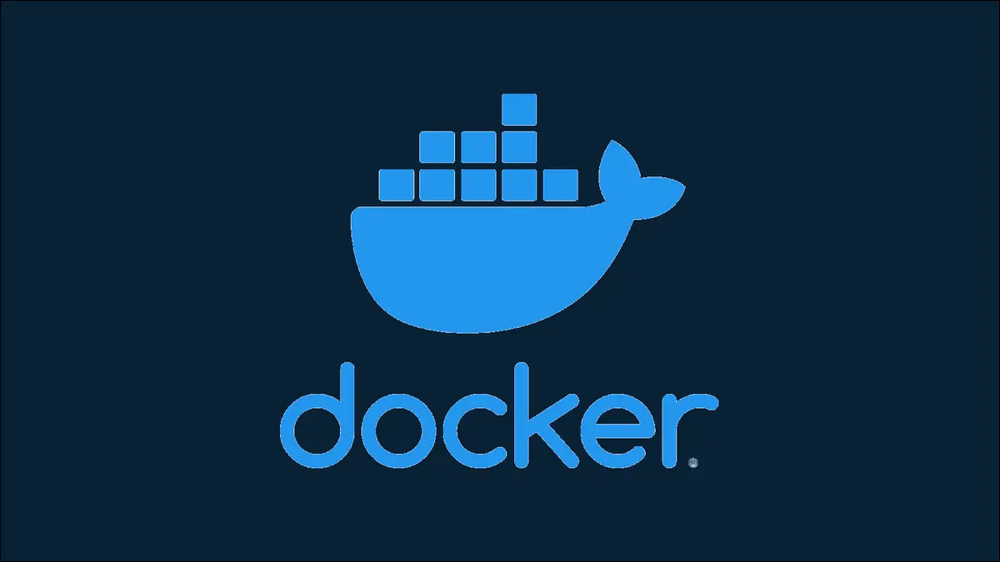

# Docker-Monitor
- Check Docker running status
- Check Container status
- Check Container health status
- Check Application status
- Check Disk Quota status (If disk used >= 80% then notify)
- Notify via email (via SendGrid API)

Entrypoint: 
    
    main.py

## Health Check
Add the Health Check Command in the Dockerfile consisting an application
For example running a node js application using docker:

Add this in Dockerfile:

        HEALTHCHECK --interval=20s --timeout=5s \
        CMD npm run start || exit 1

## Run Command:
Using Bash:

- Configure the changes in `monitor.sh`
        
        #!/bin/bash

        WORKING_DIR="docker-monitor"
        CONTAINER_NAME="enter_container_name_or_id"
        IP="127.0.0.1"
        PORT=8080
        DISK="/"
        FROM="sender@email"
        TO=("reciever@email1" "reciever@email2" "reciever@email3")

- Then run
    
        bash monitor.sh
    
Using Conda:

    python main.py -n CONTAINER_NAME -ip IP -port PORT -disk "/" -from FROM -to TO

## Run in Remote VMs
This project is specifically designed to run on remote VMs and switch between VMs
using the `vm-ssh-script.sh`

        #!/bin/bash

        WORKING_DIR="docker-monitor"
        CONTAINER_NAME="enter_container_name_or_id"
        IP="127.0.0.1"
        PORT=8080
        DISK="/"
        FROM="sender@email"
        TO=("reciever@email1" "reciever@email2" "reciever@email3")

        #Switch between VMs using SSH and execute docker-monitoring script
        eval `ssh-agent` > /dev/null
        ssh-add ~/.ssh/ssh-key >/dev/null 2>&1

        ssh host@ip bash -l << ENDSSH
            source ~/miniconda3/bin/activate docker-monitor
            cd ${WORKING_DIR}
            python main.py -n "${CONTAINER_NAME}" -ip "${IP}" -port ${PORT} -disk "/" -from "${FROM}" -to ${TO[@]}
        ENDSSH

## CLI Flags:
Usage:

    $ python main.py -h
    usage: main.py [-h] [-v] -n N -ip IP -port PORT -disk DISK -from_ FROM_ -to_ TO_ [TO_ ...]

    Docker-Monitor: A script to monitor your docker containers runinng in different VMs

    optional arguments:
    -h, --help          show this help message and exit
    -v                  show program's version number and exit
    -n N                Pass the Container NAME/ID
    -ip IP              Pass the local IP (e.g: 127.0.0.1) of the VM
    -port PORT          Pass the PORT number where the docker app is exposed (e.g 8080)
    -disk DISK          Pass the disk mount path to check for disk quota stats (e.g. '/')
    -from_ FROM_        Sender Mail (Required for sending notifications for the Container status)
    -to_ TO_ [TO_ ...]  Pass the receiver mail id/ids (will be taken as a list)
